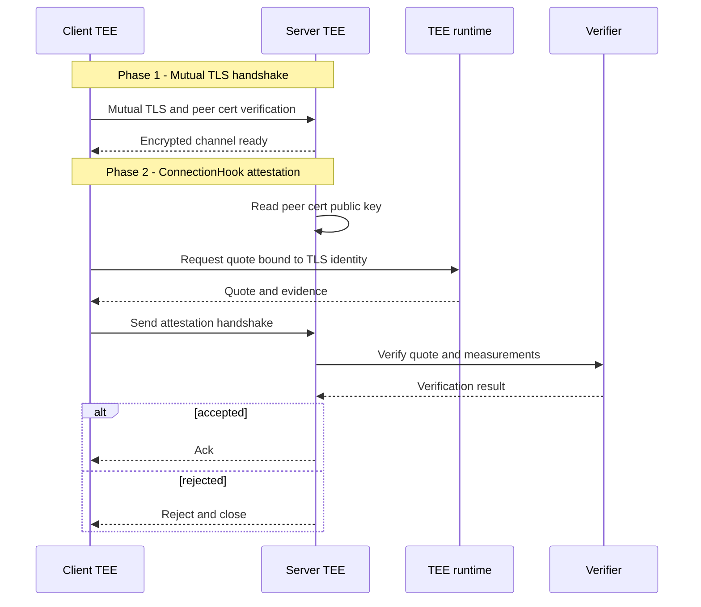

## Introduction

If two services run inside TEEs and communicate over TLS, what exactly have you
proven after the handshake?

You proved channel confidentiality and that each side owns its TLS private key.
You did _not_ prove what code is actually running behind that key.

That missing piece is where attested TLS (aTLS) comes in: bind remote
attestation evidence to the encrypted channel, so peers can verify both
transport identity and TEE state.

In this post, I will share the practical path we took at Chainbound. We needed
a reliable way to ensure the other side of a connection was running inside a
TEE, and we knew aTLS as a general concept, but we did not start by
implementing the draft directly. We first shipped a working TEE-to-TEE
attestation flow over TLS as a pluggable `ConnectionHook` in
[`msg-rs`](https://github.com/chainbound/msg-rs), then went back to the aTLS
specification and reference implementation to understand what we were missing,
what we already got right, and what each additional mechanism buys you.

This is a practical walkthrough, not an exhaustive RFC commentary.

<Callout type="info">
  Key takeaway: a build-first baseline can be perfectly valid in controlled
  deployments, as long as you later map it against the standard and explicitly
  decide which additional mechanisms you need for your threat model.
</Callout>

If you want more context on `msg-rs`, we covered it in previous entries such as
[Linkem](/linkem) and [Introducing Flowproxy](/introducing-flowproxy).

## Why ConnectionHooks are the right place

`msg-rs` recently introduced connection hooks that run after transport setup and
before application traffic. That is exactly where attestation belongs.

We decided to use this component so business logic does not need to concern
itself with transport attestation. If we need to change connection
initialization behavior later, we can do it in hook wiring and configuration
rather than application handlers.

With this model, we get transport-agnostic authentication gates, policy
isolation, and clear fail-fast behavior before any application payload is
accepted.

For the exact API, see
[`msg_socket::ConnectionHook`](https://docs.rs/msg-socket/latest/msg_socket/hooks/trait.ConnectionHook.html).

With this, we attach an attestation hook to the sockets that need trust
enforcement. If attestation fails, the connection is rejected immediately.

## The TEE-to-TEE flow we shipped

After mutual TLS completes, both peers run `ConnectionHook` logic before any
application message is accepted. Each side extracts the peer certificate public
key from the active TLS session, asks the local TEE runtime for evidence bound
to that session, and exchanges attestation payloads over the encrypted channel.

In our current deployment this is mutual attestation, so each side verifies the
other before admitting application traffic. To keep the diagram readable, the
sequence below shows one direction only. The reverse direction is symmetric.

Here is the flow in diagram form:

In our production use case, we bind a stable TEE identity to an ephemeral TLS
session key so auditing and allowlist policy can remain stable even as
transport keys rotate. This lets policy remain anchored to a durable identity
while session keys rotate freely.

## Then we looked at the aTLS spec

Once we had the hook-based flow working, we went back and studied aTLS
properly. The current IETF draft standardizes this
binding in a portable, interoperable way.

Useful references:

- [IETF draft](https://datatracker.ietf.org/doc/draft-fossati-seat-expat/)
- [Reference implementation](https://github.com/tls-attestation/attestation-exported-authenticators)
- [FOSDEM 2026 slides](https://fosdem.org/2026/events/attachments/GHGFBM-attestedtls/slides/267432/20260201_60u9e0n.pdf)

Conceptually, aTLS runs attestation _after_ a normal TLS 1.3 handshake, uses
RFC 9261 Exported Authenticators as the message shape, and uses Exported Keying
Material (EKM) to bind evidence to the specific TLS session.

The reference implementation also wraps evidence using RATS CMW, so evidence
formats remain platform-agnostic.

## A lightweight binding alternative for controlled deployments

When we compared our implementation against the draft, one key difference stood
out: the draft binds attestation to the session using EKM, while our initial
implementation bound attestation to the TLS certificate public key.

Our baseline intuition was cert-pubkey binding: generate the TLS keypair
inside the TEE, put the cert pubkey hash into the attestation quote input,
verify measurements and policy, and trust the session.

**Is that enough, or do you need EKM?**

### Why cert-pubkey binding can be sufficient

For a controlled deployment where cert keys are generated inside the TEE and
never leave it, the TLS handshake already proves key possession
(`CertificateVerify`), and only the TEE can satisfy that proof. The quote then
proves expected measurements, while quote input data ties that quote to the
cert key used in TLS. Under this model, an outside attacker cannot replay a quote
and complete the handshake without also possessing the key, so cert-pubkey
binding is a sound baseline.

### Why aTLS still prefers EKM

EKM adds value in broader or stricter models. If key bytes are exfiltrated
through side channels, an attacker could complete TLS handshakes with stolen
key material. EKM is unique per session, so captured attestation cannot be
replayed across sessions even with the same cert key. Standards also need an
interoperable channel binding mechanism that does not assume a TEE-generated
cert lifecycle.

So this is not either-or. EKM is a stronger and more general binding primitive.
The practical question is when you need that extra strength.

## Threat-model menu: pick what you need

After mapping our implementation against the standard, we found it more useful
to think in threat-model slices than in binary "compliant or not" terms.

| Mechanism | What it protects against | When to use | Cost |
| --- | --- | --- | --- |
| Quote input bound to TLS cert pubkey | Detached quote replay with unrelated cert/key | Baseline for TEE-generated cert deployments | Low |
| Challenge nonce | Reusing old evidence without proving freshness of attestation request | If freshness must be explicit beyond handshake liveness | Low |
| EKM binding (RFC 5705) | Session replay even under key exfiltration scenarios | High assurance, mixed trust, non-TEE-managed cert lifecycle | Low-medium |
| Mutual attestation | One-sided trust in asymmetric topologies | Any topology where both peers need TEE guarantees | Medium |
| CMW evidence wrapping | Platform lock-in and custom evidence formats | Multi-platform or multi-org deployments | Low |
| Full RFC 9261 Exported Authenticators | Incompatibility with other implementations | Required for cross-implementation interoperability | Medium-high |

A pragmatic rollout strategy is to start with cert-pubkey binding and a strict
measurement policy, add a nonce when you need explicit freshness, then add EKM
for defense-in-depth, and finally adopt RFC 9261 plus CMW when interoperability
becomes a requirement.

## aTLS in the wild

The pattern shows up outside TLS as well. Confer's
[Private inference](https://confer.to/blog/2026/01/private-inference/) writeup
uses Noise Pipes instead of TLS, but the core idea is the same: bind
attestation evidence to the cryptographic channel that carries application
traffic.

Their use case is one-directional, where the client verifies the inference
endpoint. Our deployment uses mutual attestation, where both peers verify each
other. The attestation topology differs, but the security shape is the same:
verify quote authenticity, bind evidence to the channel handshake keys, and
validate measurements before trusting application data. aTLS is best viewed as
a TLS-specific standardization of that broader channel-binding pattern.

## Conclusion

aTLS solves a real problem: binding remote attestation to an encrypted channel.

Our path was not spec-first. We needed to ensure peers were genuine TEEs, so we
implemented a practical solution first, then studied the standard in detail.
That second step gave us a clear map of which guarantees we already had, which
ones we did not, and why we might want each additional mechanism.

> The right question is not "Did we implement every RFC mechanism?". The right
> question is "Which attacks matter for our deployment, and which mechanism
> closes that gap?".

That framing turns aTLS from an all-or-nothing standard into a practical design
toolbox for secure systems engineering.
