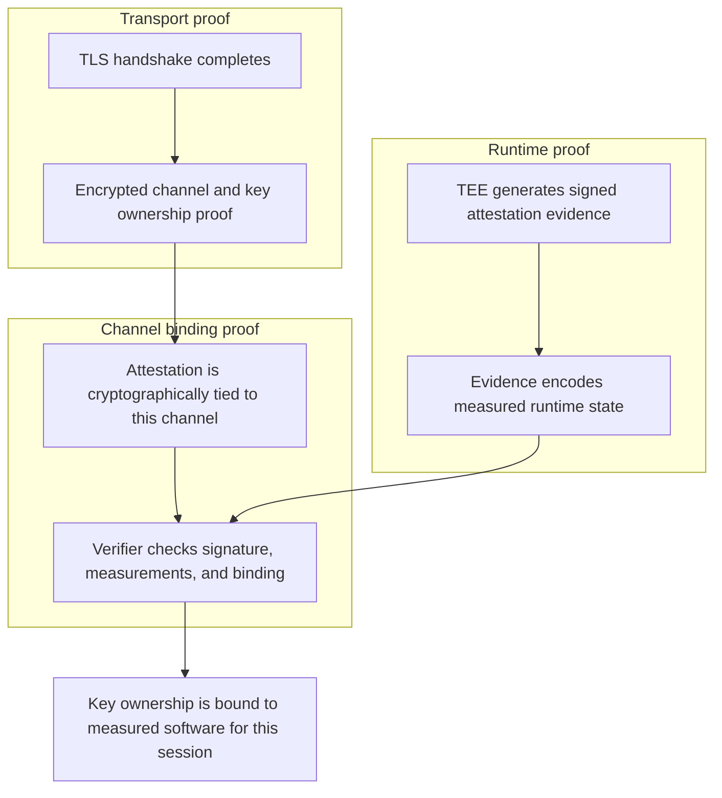
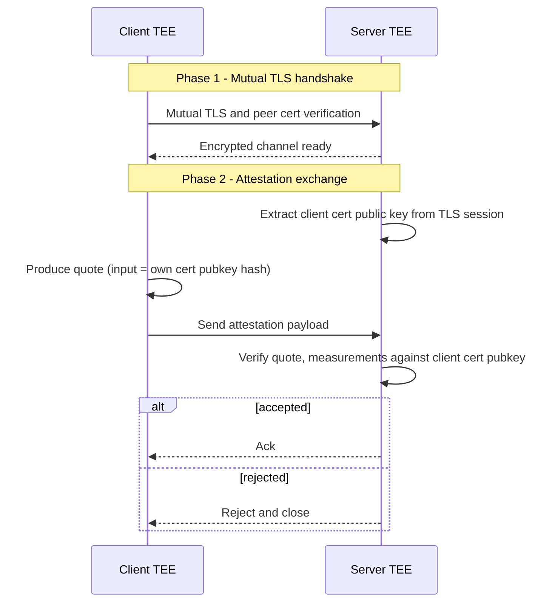

import { Accordion, Accordions } from 'fumadocs-ui/components/accordion';

# Introduction

Trusted Execution Environments (TEEs) are a practical foundation for confidential computing: they protect code and memory at runtime, even when the surrounding host is not fully trusted.

But distributed systems are remote by default, so the question becomes: how does a client verify that it's really talking to a TEE endpoint, that the channel terminates inside that TEE (no eavesdropping), and that the endpoint is running the expected software?

Transport Layer Security (TLS) provides part of the answer: channel confidentiality and authenticity. A client can authenticate a server through a public key (Web PKI). However, TLS alone doesn't show that the key is usable only from inside the TEE. To get that guarantee, you need a way to prove what runtime generated that key, and to bind those runtime claims to the specific live session.

This is where attested TLS (aTLS) comes in: bind remote attestation evidence to the live TLS session so peers can verify transport identity, TEE authenticity, and expected runtime state.

<Callout type="idea" icon={<IdeaIcon />}>
Put differently, aTLS answers one question: does this session key belong to this measured software instance?
</Callout>

In this post, we describe how we handled this in practice while migrating a network of TEEs from libp2p to a new transport. We first shipped a working TEE-to-TEE mutual attestation flow, then mapped it to the aTLS draft and reference implementation to understand what we matched, what we didn't, and what the extra mechanisms buy you under different threat models.

<Callout type="warning">
In this article, when we refer to aTLS we are always talking about **Post-Handshake** Attested TLS, as that's the pattern we are using in our implementation.
There are 2 more variants of aTLS currently in discussion within the IETF: **Pre-Handshake** and **Intra-Handshake,** both covered by the FOSDEM talk referenced below.
</Callout>

# The Remote TEE Trust Problem

For a remote peer, three properties must hold at the same time to extend TEE guarantees such as confidentiality and integrity to the network channel:

1. **Channel confidentiality and integrity.** Traffic must be unreadable and tamper-evident in transit, otherwise sensitive inputs and outputs can be leaked or modified.
2. **Endpoint authenticity and in-TEE termination.** The remote endpoint must be the intended TEE-backed peer, not a substituted endpoint or a man-in-the-middle. To guarantee this, encryption must terminate inside the TEE (i.e. plaintext only exists within the enclave's protected memory).
3. **Runtime integrity against policy.** The remote TEE must be running software state that matches policy; otherwise you may be talking to a genuine TEE running the wrong code.

TLS gives you an encrypted channel and proof of key ownership; remote attestation gives you evidence about runtime state. aTLS is the standard way to make those proofs refer to the same live session.

# aTLS at a High Level

## Quick (m)TLS Refresher

TLS 1.3 starts with a handshake that negotiates fresh session keys and authenticates certificate key ownership. In mutual TLS, both peers present certificates and prove possession of their private keys by signing a challenge.

This gives you an encrypted and authenticated channel, addressing the first 2 problems, although it doesn't really provide any assurances that you are talking to a TEE directly (second half of problem 2) or that you are indeed communicating to the *exact* TEE you are expecting (problem 3).

## What aTLS Adds

The easiest way to reason about aTLS is as a composition of three independent proofs that must all hold at the same time.

TLS proves channel confidentiality and peer key ownership. Attestation proves what code is running in the TEE. Binding proves that the attestation evidence belongs to this exact secure channel, not some other session.



This security shape is the core idea behind aTLS. The specific message formats and primitives can vary, but the outcome should be the same: channel key ownership is cryptographically bound to attested software identity.

With that model in place, we can now move from generic protocol properties to the concrete T+ deployment that motivated our implementation.

# The T+ Confidential Exchange

T+ ([@tplus_cx](http://x.com/tplus_cx)) is a multi-node confidential exchange with different service roles, each running in its own TEE. In this setup, end-to-end attestation is a networking requirement: peers need confidential channels, proof that the remote endpoint is a genuine TEE peer, and proof that its running expected software, to ensure full trade privacy. In the T+ system, **critical communication flows are fully end-to-end attested, and thus confidential**.

That requirement shaped our transport design, which we are describing next.

## The TEE-to-TEE Flow We Shipped

After a mutual TLS handshake establishes an encrypted channel and verifies peer certificates, both peers run an attestation exchange to complete the custom handshake.

Each side extracts the other peer's certificate public key from the active TLS session, asks the local TEE runtime for their own evidence bound to that session, and exchanges attestation payloads over the encrypted channel, verifying that the received payload is valid against the extracted peer's certificate public key and TEE runtime state.

Since each node generates a self-signed peer certificate at startup, the transport identity is ephemeral and tied to the TEE's lifetime. Making use of this allows us to guarantee that the only entity in possession of the certificate and that could thus complete the handshake *must* be the intended TEE peer we just verified.

In TDX (and similar TEE platforms), this attestation evidence is called a **quote**: a hardware-signed statement that includes measurements, including cryptographic digests of the code, configuration, and initial state loaded into the TEE. In addition, a quote also carries caller-supplied input data, which is how we bind it to TLS identity: the caller includes the TLS cert public key as input data.

**This is how the channel is proven to be secure: the quote attests to the fact that the code and the runtime state is what we expect, and it also binds to the ephemerally generated and unique, self-signed certificate**.

Here is the flow in diagram form:

<Callout type="info">
In our current deployment this is mutual attestation, so each side verifies the other before admitting protocol traffic. To keep the diagram readable, the sequence below shows one direction only. The reverse direction is symmetric.
</Callout>



In production, we also bind a stable identity (for example the node operator) to the ephemeral TLS session so auditing and policy stay stable even as transport keys rotate.

With that flow in place, the integration point became clear: the attestation check should run after transport setup, but before protocol traffic is accepted.

## Why ConnectionHooks Were the Right Migration Point

[`msg-rs`](https://github.com/chainbound/msg-rs), our Rust messaging transport library, recently introduced connection hooks that run after transport setup and before protocol traffic. Connection hooks make it trivial to implement application-layer handshakes, which is exactly where attestation belongs.

<Callout type="info">
If you want more context on `msg-rs`, we covered it in previous entries such as [Linkem](https://engineering.chainbound.io/linkem) and [Introducing Flowproxy](https://engineering.chainbound.io/introducing-flowproxy).
</Callout>

[`ConnectionHook`](https://docs.rs/msg-socket/latest/msg_socket/hooks/trait.ConnectionHook.html) was also the migration lever for us: it let us re-implement trust-boundary behavior that previously lived in fork-specific libp2p code as an explicit, reusable integration point in `msg-rs`. This preserved T+'s existing attestation requirement while keeping transport attestation out of business logic.

If code is more your *vibe* than prose, here's a short example taken from the library:

<Accordions type="single">
<Accordion title="The trait itself">

```rust
/// Runs after transport setup, before protocol traffic.
/// Return Ok(io) to accept, Err to reject and close.
trait ConnectionHook<Io> {
    type Error;
    async fn on_connection(&self, io: Io) -> HookResult<Io, Self::Error>;
}
```

</Accordion>
<Accordion title="A minimal attestation handshake hook">

```rust
impl<Io, F> ConnectionHook<Io> for AtlsServerHook<F>
where
    Io: AsyncRead + AsyncWrite + Send + Unpin + 'static + TlsCerts,
    F: Fn(&Bytes) -> bool + Send + Sync + 'static,
{
    type Error = ServerHookError;

    async fn on_connection(&self, io: Io) -> HookResult<Io, Self::Error> {
        // Obtain the peer certificate from the underlying transport
        let client_cert = io.peer_cert();
                  
        let mut conn = Framed::new(io, Codec::new_server());

        // Wait for the client to send their attestation
        let msg = conn.next().await
            .ok_or(Error::hook(ServerHookError::ConnectionClosed))?;

        let Message::Attestation(payload) = msg? else {
            return Err(Error::hook(ServerHookError::ExpectedAuthMessage));
        };
        
        // Validate the client's attestation against the certificate used 
        // for the TLS session
        if !self.validate_attestation(payload, client_cert) {
            conn.send(auth::Message::Reject).await?;
            return Err(Error::hook(ServerHookError::Rejected));
        }

        conn.send(Message::Authenticated).await?;
        // remove Framed wrapper and return the, now attested, IO
        Ok(conn.into_inner())
    }
}
```

</Accordion>
<Accordion title="Wiring it up">

```rust
// Server: validate incoming attestations
let pub_socket = PubSocket::new(Tcp::default())
    .with_connection_hook(AtlsServerHook::new());

// Client: send attestation on connect
let sub_socket = SubSocket::new(Tcp::default())
    .with_connection_hook(AtlsClientHook::new());
```

</Accordion>
</Accordions>

With this abstraction in place, we can attach an attestation hook to the sockets that need trust enforcement. If attestation fails, the connection is rejected immediately before the application can make use of it.

# From Our Implementation to aTLS

With that working baseline in place, we mapped it against the aTLS draft to see where it aligned, where it diverged, and why.

The current IETF draft standardizes this binding in a portable, interoperable way. Like our flow, aTLS runs attestation after a normal TLS 1.3 handshake.

The difference is in the machinery it uses, which rests on three building blocks:

- **Exported Keying Material (EKM) ([RFC 5705](https://datatracker.ietf.org/doc/html/rfc5705))**: a value derived from the TLS master secret that is unique per session. Including it in the attestation evidence binds the produced quote to the *session.*
- **Exported Authenticators ([RFC 9261](https://datatracker.ietf.org/doc/html/rfc9261))**: a standard message format that lets a TLS peer prove an additional identity after the handshake, reusing TLS's own structure. aTLS uses this as the envelope for attestation evidence.
- **RATS Conceptual Message Wrapper ([draft](https://datatracker.ietf.org/doc/draft-ietf-rats-msg-wrap/))**: a uniform container for platform-specific attestation evidence (e.g. a TDX quote) with type metadata, so verifiers
don't need custom parsing per platform.

<Callout type="info">
Useful references for aTLS itself:

- [IETF draft](https://datatracker.ietf.org/doc/draft-fossati-seat-expat/)
- [Reference implementation](https://github.com/tls-attestation/attestation-exported-authenticators)
- [FOSDEM 2026 Talk](https://fosdem.org/2026/schedule/event/GHGFBM-attestedtls/)
</Callout>

## Cert-Pubkey Binding vs EKM in Controlled Deployments

Comparing our implementation to the draft, one difference mattered most: the standard binds evidence to the session using EKM, while our version bound it to the TLS certificate public key. The rest of this section is about when that difference changes the security story.

Our baseline intuition was cert-pubkey binding: generate the TLS keypair inside the TEE, put the cert pubkey hash into the attestation quote input, verify measurements and policy, and trust the session.

**Is that enough, or do you need EKM?**

In our case, that question is evaluated under explicit assumptions: a controlled peer set, startup-generated self-signed certs, and TEEs expected to run the same measured software.

### Why Cert-Pubkey Binding Can Be Sufficient

For a controlled deployment where cert keys are generated inside the TEE and never leave it, the TLS handshake already proves key possession, and only the TEE can satisfy that proof.

The quote then proves expected measurements, while quote input data ties that quote to the cert key used in TLS. Under this model, an outside attacker cannot replay a quote and complete the handshake without also possessing the key, so cert-pubkey binding is a sound baseline.

### Why aTLS Still Prefers EKM

EKM adds value in broader or stricter models. If key bytes are exfiltrated through side channels, an attacker could complete TLS handshakes with stolen key material.

EKM is unique per session, so captured attestation cannot be replayed across sessions even with the same cert key. Standards also need an interoperable channel binding mechanism that does not assume a TEE-generated cert lifecycle.

So this is not either-or. EKM is a stronger and more general binding primitive. The practical question is when you need that extra strength.

## Threat-model Menu: Pick What You Need

In practice, the mapping became a menu: pick a threat model, then pick the mechanism that addresses it.

| Mechanism | What it protects against | When to use | Cost |
| --- | --- | --- | --- |
| Quote input bound to TLS cert pubkey | Detached quote replay with unrelated cert/key | Baseline for TEE-generated cert deployments | Low |
| Challenge nonce | Reusing old evidence without proving freshness of attestation request | If freshness must be explicit beyond handshake liveness | Low |
| EKM binding (RFC 5705) | Session replay even under key exfiltration scenarios | High assurance, mixed trust, non-TEE-managed cert lifecycle | Low-medium |
| Mutual attestation | One-sided trust in asymmetric topologies | Any topology where both peers need TEE guarantees | Medium |
| CMW evidence wrapping | Platform lock-in and custom evidence formats | Multi-platform or multi-org deployments | Low |
| Full RFC 9261 Exported Authenticators | Incompatibility with other implementations | Required for cross-implementation interoperability | Medium-high |

A pragmatic rollout strategy is to start with cert-pubkey binding and a strict measurement policy, add a nonce when you need explicit freshness, then add EKM for defense-in-depth, and finally adopt RFC 9261 plus CMW when interoperability becomes a requirement.

# Other Sightings

### Confer's Private Inference

The pattern shows up outside TLS as well. Confer's [Private inference](https://confer.to/blog/2026/01/private-inference/) writeup explains how they can serve fully private AI inference. They use [Noise](https://noiseprotocol.org/) Pipes instead of TLS, but the core idea is the same: bind attestation evidence to the cryptographic channel that carries protocol traffic.

Their use case is one-directional, where the client verifies the inference endpoint. Our deployment uses mutual attestation, where both peers verify each other.

The attestation topology differs, but the security shape is the same: verify quote authenticity, bind evidence to the channel handshake keys, and validate measurements before trusting application data.

### Flashbots & MEV

Another example is Flashbots' [attested-tls-proxy](https://github.com/flashbots/attested-tls-proxy), a reverse HTTP proxy that runs a post-handshake attestation exchange after a normal TLS 1.3 handshake, using ALPN (Application-Layer Protocol Negotiation) to signal that attestation is expected.

Its binding event covers both the cert-pubkey and EKM rows of our threat-model menu! It does so by combining a hash of the TLS leaf certificate public key with TLS exporter material.

Flashbots use aTLS extensively throughout their confidential MEV products to provide their users with verifiable privacy. They're also involved in developing the aTLS standard.

<Callout type="idea" icon={<IdeaIcon />}>
aTLS is best seen as the TLS-specific standardization of that broader channel-binding pattern.
</Callout>

# Conclusion

aTLS solves a real problem: binding remote attestation to an encrypted channel.

Our path was not spec-first. We were migrating T+ from a forked networking stack to `msg-rs` and had to preserve an existing TEE-to-TEE attestation requirement during that transition, so we implemented a practical hook-based solution first and then studied the standard in detail.

That second step gave us a clear map of which guarantees we already had, which ones we did not, and why we might want each additional mechanism.

<Callout type="idea" icon={<IdeaIcon />}>
The right question is not "Did we implement every RFC mechanism?". The right question is "Which attacks matter for our deployment, and which mechanism closes that gap?".
</Callout>

That framing turns aTLS from an all-or-nothing standard into a practical design toolbox for secure systems engineering.
