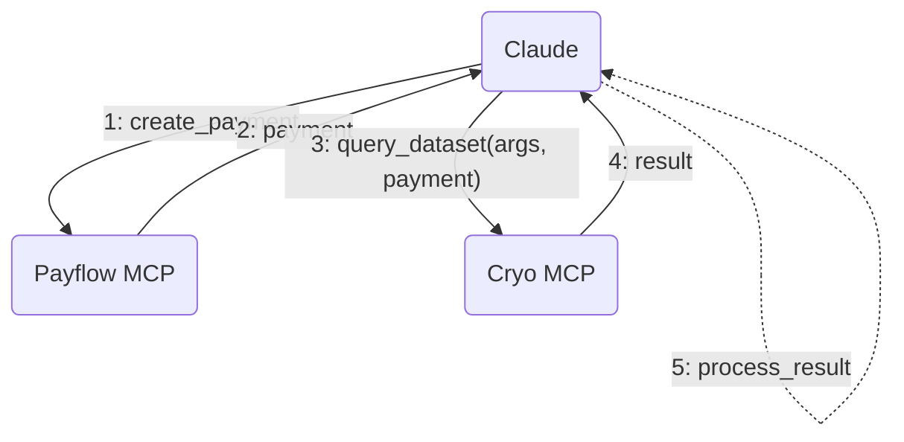

**TLDR**; We’re releasing Payflow, a toolkit and an exploration of agentic
commerce through an MCP server powered by
[Cryo](https://github.com/paradigmxyz/cryo) and
[Reth](https://github.com/paradigmxyz/reth), with paid tools using
[x402](https://www.x402.org/) micropayments.

Check out the demo [here](https://cryo-mcp.fly.dev/) and the code
[here](https://github.com/chainbound/payflow).

## Introduction

At Chainbound, we’ve been using agentic tools for engineering and research work
for a while now. Our AI arsenal includes integrated tools like Claude Code,
Codex, Cursor and Deep Research, but more and more it’s also starting to include
various [MCP](https://modelcontextprotocol.io/introduction) servers.
[Exa](https://docs.exa.ai/examples/exa-mcp) is a good example: it can
supercharge the web search capabilities of your agents by including specialized
tools like `research_paper_search`**,** `company_research` and `github_search`.

One annoyance right now, and potentially serious bottleneck in the future, is
that each of these different MCP servers requires you to register for an account
(using your human credentials), and then either sign up for a monthly
subscription or load up on credits. Imagine your AI agent needs to analyze a
competitor's GitHub repositories (using Exa's GitHub search), fetch real-time
market data (via a financial data MCP), and then cross-reference patent filings
(through a legal research MCP). Today, this requires you to manually sign up for
three services, manage three sets of credentials, and probably pay three monthly
fees.

Looking at the future, we believe a more scalable solution will need to come
into place, as tens of thousands of useful MCP servers will be supplying your
agent with different tools and resources, or potentially access to _other AI
agents._ [Smithery](https://smithery.ai/?q=is%3Aremote), an MCP registry, shows
us we’re actually not that far from that situation, with hundreds of remote MCP
servers. MCP is [claimed to tackle](https://humanloop.com/blog/mcp) what’s known
as the “M×N integration problem”, which refers to the exponential complexity
involved in connecting **M agents** to **N integrations** if they all follow a
different protocol. The standardization that MCP brings makes this true on a
technical level, but if each MCP integration requires human involvement, _are we
reaching the full capacity of autonomous agents?_ [1]

In that world, there are a couple of things that don’t work in the flow we
described earlier, and they are closely interrelated:

1. **Identity**: using traditional authentication, authorization, and
   potentially KYC methods, which are _always_ tailored towards humans and
   require humans to be in the loop. This will also be a problem on the
   receiving side of the payments. For example, try setting up a Stripe merchant
   account as an AI agent, and you will certainly run into problems.
2. **Payments**: human-focused, clunky and potentially inefficient payment
   methods such as prepaid credits or monthly subscriptions. On top of that,
   small, pay-per-use payments are
   [too](https://www.reddit.com/r/stripe/comments/1bno93e/comment/kwn2hxi/?utm_source=share&utm_medium=web3x&utm_name=web3xcss&utm_term=1&utm_content=share_button)
   expensive using traditional rails.

Interestingly, cheap blockchains allow you to tackle both at the same time.
Blockchains allow anyone (including machines) to create and own a non-custodial
wallet, that gives them a unique global address on which to receive transactions
as an (autonomous) merchant. As an AI consumer, the corresponding private key
can be used to authorize transactions from that wallet. An address becomes a
universal API key. [2]

With smart contract wallets, developers can encode arbitrarily complex spending
rules & authorization methods for their agents, enforced by the contract itself.
The agent could be assigned a passkey to sign transactions with, that only allow
it to spend a certain amount through various rate limits.

Additionally, stablecoin-based micropayment protocols like Coinbase
[x402](https://www.x402.org/) make it much easier to create and accept
stablecoin payments without any human involvement. This is why we felt the
timing was right to explore this paradigm further.

## What is Payflow?

Payflow is our interpretation and example of agentic commerce. It includes 3
things:

- An SDK for building paid MCP servers
- A local MCP server for your agent to create payments
- A demo Payflow-enabled MCP server that puts the 2 together

### `payflow-sdk`

A TypeScript SDK that seamlessly extends
[`@modelcontextprotocol/sdk`](https://github.com/modelcontextprotocol/typescript-sdk)
with the ability to register paid tools using the x402 payment schema. Check out
the code and documentation on Github:
[`@chainbound/payflow-sdk`](https://github.com/chainbound/payflow/tree/main/packages/payflow-sdk).

Adding a paid tool using the `payflow-sdk` is as easy as:

```typescript
import { PayflowMcpServer } from '@chainbound/payflow-sdk';
import { StdioServerTransport } from '@modelcontextprotocol/sdk/server/stdio.js';
import { z } from 'zod';

// Create a server
const server = new PayflowMcpServer(
  {
    name: 'my-paid-server',
    version: '1.0.0',
  },
  {
    // Configure x402
    x402: {
      version: 1,
      keyId: process.env.CDP_API_KEY_ID,
      keySecret: process.env.CDP_API_KEY_SECRET,
    },
  },
);

// Simple paid tool without parameters
server.paidTool(
  'hello_world',
  'Says hello to the world',
  {
    price: 0.01, // Price in USDC
    recipient: '0x1234...', // Ethereum address to receive payment
  },
  async () => {
    return {
      content: [
        {
          type: 'text',
          text: 'Hello, World!',
        },
      ],
    };
  },
);

// Connect transport
const transport = new StdioServerTransport();
await server.connect(transport);
```

This will mark `hello_world` as a paid tool, and the Payflow SDK will add the
necessary description, arguments and return types to ensure the agent using this
tool understands the requirements. The payments are currently settled with
Coinbase’s mainnet facilitator on Base.

<Callout type="info">
  This library is still alpha and we're looking for feedback and feature
  requests.
</Callout>

Some potential improvements we’re thinking about:

- Support for
  [Agent Commerce Kit](https://www.agentcommercekit.com/overview/introduction)
  ACK-PAY, with multiple different settlement methods and currencies.
- Support for custom x402 facilitators.
- Extending the library to support paid resources on top of paid tools.

### `payflow-mcp`

Giving an agent access to payment credentials directly in its context window is
not a good idea. In Payflow, the way we deal with this is a fully private, local
MCP server called
[`payflow-mcp`](https://github.com/chainbound/payflow/tree/main/packages/payflow-mcp)
that specifies one important tool (simplified):

```jsx
create_payment(amount, recipient);
```

Only the MCP server holds the credentials, and can be configured with hard
limits that make sure the agent doesn’t bankrupt any connected wallets. MCP
hosts like Claude always request permission to call a certain tool (unless
turning it off), so if required, a human in the loop can still authorize the
payments after checking the details.

Configuring it in Claude is as easy as putting the following into your
`claude_desktop_config.json` file:

```json title="claude_desktop_config.json"
{
  "mcpServers": {
    "payflow": {
      "command": "npx",
      "args": ["@chainbound/payflow-mcp"],
      "env": {
        // The private key of the agent's wallet
        "PRIVATE_KEY": "",
        // Hard payment limit per query
        "MAX_PAYMENT_AMOUNT_USDC": "10"
      }
    }
  }
}
```

### `Cryo MCP`

An [example Payflow MCP server](https://github.com/chainbound/cryo-mcp) that
wraps around [Cryo](https://github.com/paradigmxyz/cryo) and is powered by a
Reth archive node. Learn more about setting it up here:
https://cryo-mcp.fly.dev/. Because we wanted this to be a realistic display of
agentic commerce, we’ve tried to make the MCP server as useful as possible, and
are excited about its capabilities. You can find some examples of what it can do
in the section [here](https://cryo-mcp.fly.dev/#examples).



## Conclusion

Agentic commerce is in its infancy. It’s still unclear what payment rails agents
would use, or how authentication & authorization would work. But crypto payments
are a serious contender, and new protocols like [x402](https://www.x402.org/)
and [Agent Commerce Kit](https://www.agentcommercekit.com/overview/introduction)
are showing a lot of promise. In a world where agents autonomously access
thousands of tools and resources, and pay other agents for services, one thing
is clear: existing mechanisms are insufficient, and cheap blockchains offer an
alternative.

Payflow attempts to display this on a smaller scale, and we offer some tools and
libraries that can help other developers to the same. If you’re interested in
iterating on this experiment with us, reach out to
[explorations@chainbound.io](mailto:explorations@chainbound.io)!

## Footnotes

1. There’s a good argument to be made that human involvement will still be
   necessary to give the green light on an MCP integration based on trust,
   because malicious MCP servers can do a lot of damage. Check out
   [these posts](https://blog.trailofbits.com/categories/mcp/) by Trail of Bits
   to get an idea. One way to address this argument would be a verifiable
   discovery and reputation layer for MCP services and other agents, but that is
   outside of the scope of this article.
2. Compliance might become more challenging in this paradigm. Compliance
   workflows might shift from KYC to KYT (Know Your Transaction) or KYA (Know
   Your Agent), and different identity and authorization schemes will be
   important. Take a look at
   [Agent Commerce Kit](https://www.agentcommercekit.com/overview/introduction)
   for a promising approach to this
   [problem](https://catenalabs.com/blog/ai-and-money-why-legacy-financial-systems-fail-for-ai-agents),
   as well as [this article](https://ernstberger.xyz/posts/03_delegate/) from
   Jens Ernstberger for more context.
