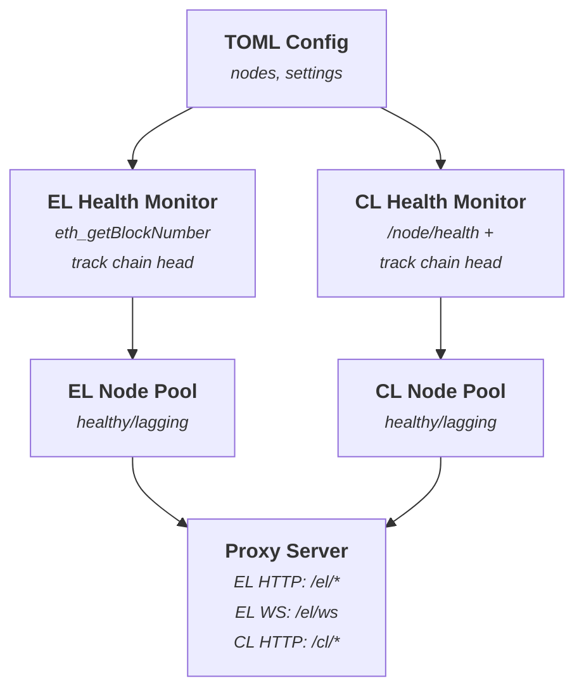

At Chainbound we regularly run internal experiments. 
Since Claude launched Opus 4.5, it has been especially fun to push it beyond toy examples. 
In this experiment, we tried to one-shot an Ethereum Execution Layer and Consensus Layer JSON-RPC proxy. 

We applied modern engineering practices as guardrails and wanted to see whether Claude can ship 
a production-ready service quickly and without too much hand-holding.

## Why build a proxy service from scratch?

We operate many execution and consensus clients as part of our infrastructure. 
When nodes fall out of sync or stop responding, we need to detect that automatically and 
fail over to a backup. This is different from load balancing: we always want a single active node, 
and we want to switch only when something is wrong.

We initially considered existing tools like [blutgang](https://github.com/rainshowerLabs/blutgang) 
and [sōzu](https://github.com/sozu-proxy/sozu). After some planning, it became clear that they 
solved a much broader problem than we needed. We would have depended on two external systems and 
used a small fraction of their features.

So we asked a different question: *what if we built a single binary that did exactly what 
we needed, for both EL and CL, and nothing more?*

## Phase 1: Specification

We started by writing a precise spec. The goal was to remove ambiguity before involving an LLM.

The service needed to:

1. Read a `config.toml` defining primary and backup nodes.
2. Continuously evaluate node health.
3. Expose HTTP and WebSocket proxy endpoints that always route to a healthy node.

Health rules were explicit:

- **Execution Layer**
    
    Call `eth_getBlockNumber`, compare block heights across nodes, track the highest one as the chain head, and compute lag. A node is unhealthy if it lags more than a configurable number of blocks.
    
- **Consensus Layer**
    
    `/eth/v1/node/health` must return HTTP 200, and `/eth/v1/beacon/headers/head` must expose 
    a slot at `/data/header/message/slot`. Track the highest slot and mark nodes unhealthy if their 
    lag exceeds a configurable threshold.
    

## Phase 2: Prompting the agent

The initial prompt lives in [this PR](https://github.com/chainbound/vixy/pull/1).

Instead of asking Claude to immediately write code, we asked it to behave like an engineer 
and produce a plan first. We created an `AGENT.md` file that instructed the agent to think 
through the system before touching implementation.

One trick that worked particularly well was asking Claude to draw an architecture diagram up front. 
This mirrors how we usually write internal design docs: start with the big picture, 
then fill in details. The diagram gave us a quick way to validate the overall approach and fix 
mistakes early, before the agent committed to a direction.

Once the architecture made sense, we asked Claude to explain the system end to end and 
break the work into phases. It produced a clear plan covering project setup, configuration, 
health checks, proxying, metrics, and testing, with explicit acceptance criteria for each step. 
From that point on, the agent could work largely autonomously without drifting.

**This is where experience matters**. LLMs are good at writing code, but they need constraints. 
Modern engineering practices act as guardrails. Without them, things get messy quickly.

### Agent-oriented Test Driven Development

The core instruction was straightforward: write the tests first, then make them pass.

Tests were treated as the source of truth. When Claude claimed something worked, 
the only thing that mattered was whether the tests passed. When code was refactored, 
correctness was defined entirely by green tests.

By the end, Claude had written 85 unit tests. Every feature started red, then went green, 
then got cleaned up. This caught real bugs: in one case, unreachable nodes were incorrectly 
marked healthy due to an edge case in the lag calculation. The failing test exposed it 
immediately, the logic was fixed, and we moved on.

We also used BDD (behavior-driven development) with [Cucumber](https://github.com/cucumber-rs/cucumber). 
The scenarios read like plain English specs: “Given an EL node at block 1000, when the health 
check runs, then it should be marked healthy.” There was no ambiguity, so Claude consistently 
implemented exactly what the scenario described. We ended up with 33 scenarios that function
as both executable tests and up-to-date documentation.

Unit tests alone are not enough, though. Eventually you have to hit real infrastructure.

For that, we used [Kurtosis](https://github.com/ethpandaops/ethereum-package) to spin up a 
local Ethereum network with four EL nodes and four CL nodes. We ran 16 integration tests against it. 
This surfaced issues unit tests could not catch, such as missing `Content-Type` header 
forwarding, which caused Geth to return HTTP 415. Another annoying bug with a trivial 
fix, caught long before production.

### Context rot and the diary pattern

LLMs do not have durable memory. As context grows, earlier details get compressed or lost. 
To deal with this, we asked Claude to maintain a `DIARY.md` file throughout development.

Each entry followed a simple structure:

- What was done
- Challenges encountered
- How they were solved
- Key takeaways
- Mood

The diary turned out to be surprisingly effective. When the Content-Type bug appeared during 
integration testing, the diary captured the failure, the debugging process, and the fix. 
When we implemented WebSocket reconnection logic, it documented the design decisions, tests, 
and type system issues involved.

When Claude's context inevitably got compacted after hours of work, it could reread the diary 
and immediately regain situational awareness. Without it, the agent would sometimes suggest 
approaches we had already tried and rejected. It became a knowledge base. 

“Why did we choose approach A over B?” The answer was always in the diary.

### Break work down, commit constantly

We also enforced small, concrete tasks. “Build the proxy server” was decomposed into steps 
like parsing requests, extracting JSON-RPC methods, and selecting a healthy node. 
Claude always knew what it was working on next.

Finally, we required a commit after every completed phase. CI ran on every commit: 
formatting, Clippy, unit tests, and BDD scenarios. If anything failed, work stopped until it was fixed. 
This prevented the classic “I'll clean it up later” failure mode. 
By the end, we had more than 60 commits, each passing CI and usable as a rollback point.

## Phase 3: Implementation

With the plan and guardrails in place, we mostly stayed out of the way.

Claude wrote tests, implemented features, ran CI, and committed. 
We stepped in to clarify requirements or review decisions, but the agent did most of the work. 
**It felt less like using a tool and more like pairing with someone who is extremely fast 
at execution but relies on you for judgment calls.**

We still hit issues like health check edge cases, Axum 0.8 route changes, 
WebSocket type mismatches and more, but the difference was that none of them lingered. 
Tests failed, the agent fixed them, and work continued.

## The result

We shipped [Vixy](https://github.com/chainbound/vixy), a production-ready Ethereum proxy that 
monitors node health, handles automatic failover, proxies both HTTP and WebSocket traffic, 
and exposes status and metrics endpoints. Here are some numbers from the experiment:

- 85 unit tests
- 33 BDD scenarios (147 steps)
- 17 integration tests against real Ethereum nodes
- 60+ CI-passing commits
- ~4,400 lines of Rust

## What we learned

Three takeaways stood out:

1. LLMs are force multipliers, not replacements. We made the architectural decisions and set quality bars. 
   Claude handled the execution. Think of it as a very fast engineer who needs clear direction and a plan.
2. Guardrails are mandatory. TDD, BDD, integration tests, small tasks, frequent commits, and written 
   context are what made this work. Without them, results would have been unpredictable.
3. Good specs unlock autonomy. A clear architecture diagram and phased plan let the agent work 
   productively for hours without constant steering.

---

**Repository:** https://github.com/chainbound/vixy

**License:** MIT / Apache-2.0

## P.S.

Special shoutout to [Mert](https://x.com/mert) for the architecture diagram tip, 
and [Lwastuargo](https://x.com/lwastuargo) for reinforcing that guardrails are everything.
